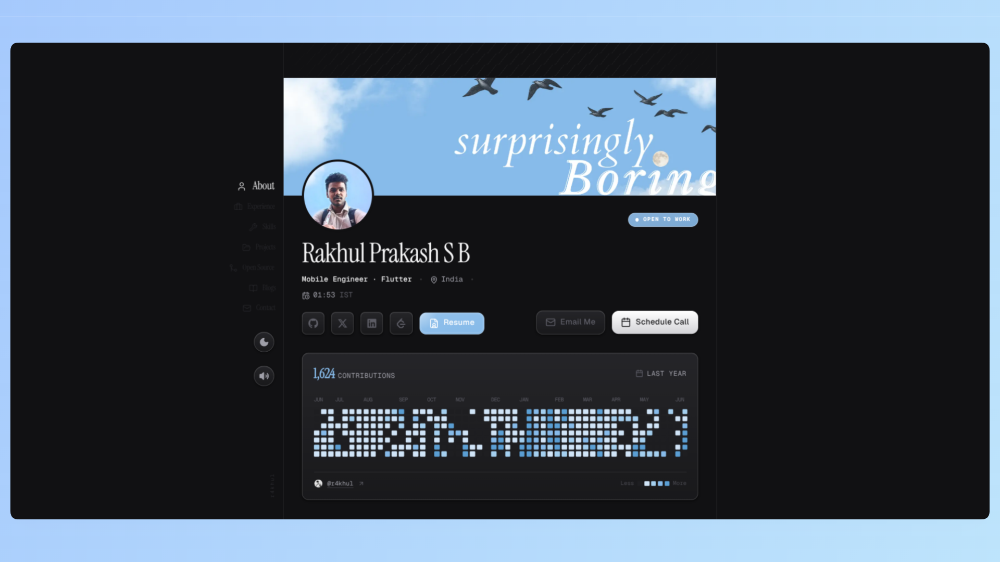
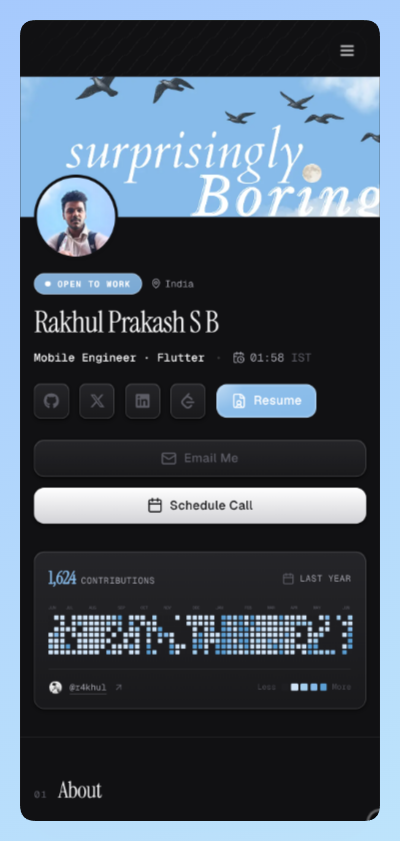

# Portfolio Site

My personal portfolio site. Clean, fast, and built with modern tools.

<div style="display: flex; gap: 1rem; align-items: stretch;">
  
  
</div>

## What's in here

- **Next.js 16** with App Router
- **Tailwind CSS v4** for styling
- **Motion** for smooth animations
- **Dark/Light mode** toggle
- **Audio feedback** on clicks (can be muted)
- **MDX** for project writeups
- **Fully responsive** - works on mobile and desktop

## How it's built

Everything is server-side rendered where possible. Static content like the navigation, metadata, and icons don't hydrate on the client. This keeps the site fast and prevents layout shifts.

Project details are written in MDX and rendered dynamically. The theme toggle and other interactive bits use modern React APIs to avoid hydration mismatches.

## Tech stack

- **Next.js 16** (Turbopack, App Router, React 19.2)
- **Tailwind CSS v4**
- **Motion** (animations)
- **Lucide React** (icons)
- **next-themes** (theme switching)
- **MDX** (content)

## Running it

```bash
npm run dev
```

Build:

```bash
npm run build
```

## Structure

```
site/
├── content/           # MDX project files
│   └── projects/
├── src/
│   ├── app/          # Next.js pages
│   ├── components/   # React components
│   ├── data/         # Static data
│   └── lib/          # Utilities
└── public/           # Static assets
```

